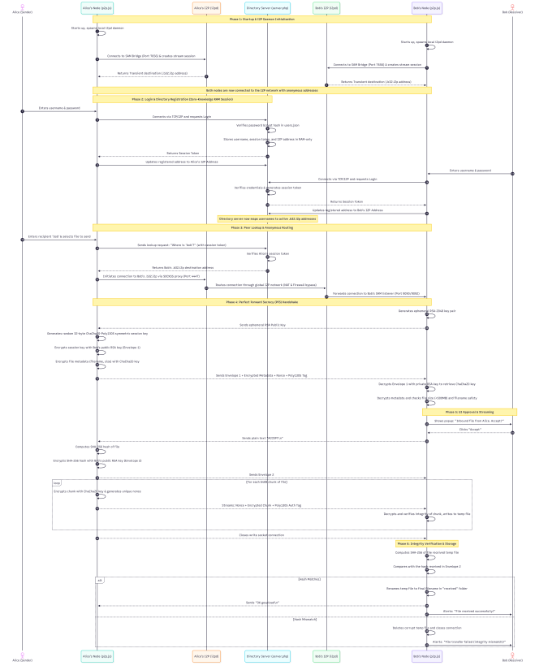

# Nexus Share

Nexus Share is a local-first, encrypted peer-to-peer file transfer project that uses I2P for peer connectivity. The Node.js app provides the browser UI and transfer protocol, while the included PHP service handles local accounts, sessions, and peer discovery.

## About this project

I built this as a school project over two weeks. It was a chance to build a small desktop style web app.

It is not a finished security product, and there are probably rough edges. If you spot a bug, have an idea, or want to improve something, feel free to open an issue or send a pull request. I would be happy to learn from the feedback.

## Features

- I2P/SOCKS-based peer connectivity
- Per-transfer RSA-OAEP and ChaCha20-Poly1305 encryption
- Authenticated transfer metadata and SHA-256 file-integrity validation
- Explicit approval for incoming transfers
- Local-only Web UI bound to `127.0.0.1`
- Uses a user-managed I2P router through its SAM and SOCKS interfaces

## Requirements

- Node.js 18 or newer
- PHP 8 with the `sockets` extension only when using the included local directory service or running its tests; it is not required for the hosted service
- A trusted, user-managed I2P router with SAM enabled (default `127.0.0.1:7656`) and SOCKS enabled (default `127.0.0.1:4447`)

## Hosted option

There is already a hosted version available at [webgenie-ai.com](https://webgenie-ai.com/). Use it if you would rather try the project in the browser without running the local setup.

The local app uses `https://webgenie-ai.com/server.php` as its default directory service. It is an HTTPS endpoint, so it uses port `443`.

## Quick start

1. Copy [.env.example](.env.example) to `.env` and adjust settings if needed. The built-in configuration loader reads `.env`; shell variables take precedence.
2. Run `npm run check` to validate JavaScript and PHP syntax.
3. Run `npm start`.
4. The browser opens automatically at <http://127.0.0.1:3000>. Register an account, then sign in.

By default, the app uses the hosted PHP directory service at `https://webgenie-ai.com/server.php` on HTTPS port `443`. To use the included local TCP directory service instead, set `AUTH_HOST=127.0.0.1`, `AUTH_PORT_UI=8000`, and `AUTH_USE_HTTP=0` in `.env`.

## Configuration

The environment template documents all supported options. Important settings include:

| Variable | Default | Purpose |
| --- | --- | --- |
| `UI_PORT` | `3000` | Local browser UI port |
| `AUTH_SERVER_URL` | `https://webgenie-ai.com/server.php` | Hosted PHP directory-service URL |
| `AUTH_PORT_UI` | `443` | Hosted HTTPS directory-service port; use `8000` for the local PHP service |
| `LISTEN_PORT` | `9090` | I2P receiver port |
| `MAX_UPLOAD_BYTES` | `26214400` | Maximum file size accepted by the Web UI (25 MiB) |
| `SOCKET_TIMEOUT` | `30000` | Peer socket inactivity timeout in milliseconds |
| `AUTO_ACCEPT` | `false` | Automatically accept incoming transfers; keep disabled unless required |

## Workflow explanation

## Development and testing

- `npm run check` — syntax-check JavaScript and PHP files

Generated files, received files, logs, and user databases are excluded through [.gitignore](.gitignore).

## Code structure

| Location | Responsibility |
| --- | --- |
| [p2p.js](p2p.js) | Composition root and public module exports |
| [src/application.js](src/application.js) | Runtime orchestration, HTTP API, I2P lifecycle, and legacy transfer protocol |
| [lib/config.js](lib/config.js) | Validated configuration and `.env` loading |
| [lib/i2p-sam.js](lib/i2p-sam.js) | SAM session negotiation and destination conversion |
| [lib/socks5.js](lib/socks5.js) | SOCKS5 proxy handshake implementation |
| [lib/logger.js](lib/logger.js) | Structured application logging |
| [lib/transfer-manager.js](lib/transfer-manager.js) | In-memory transfer lifecycle management |
| [lib/validators.js](lib/validators.js) | Input and filename validation |

## Security notes

The app validates filenames, limits request sizes, authenticates sessions, and verifies received file hashes. It does not download, install, or launch router binaries; install and trust your I2P router separately.

Please treat this as an educational project rather than a production-ready secure file-sharing service.

## Contributing

Small fixes, clearer documentation, tests, and security feedback are all useful. For bigger changes, opening an issue first makes it easier to discuss the direction before work starts.

## Repository publishing

This project is available under the [MIT License](LICENSE).
